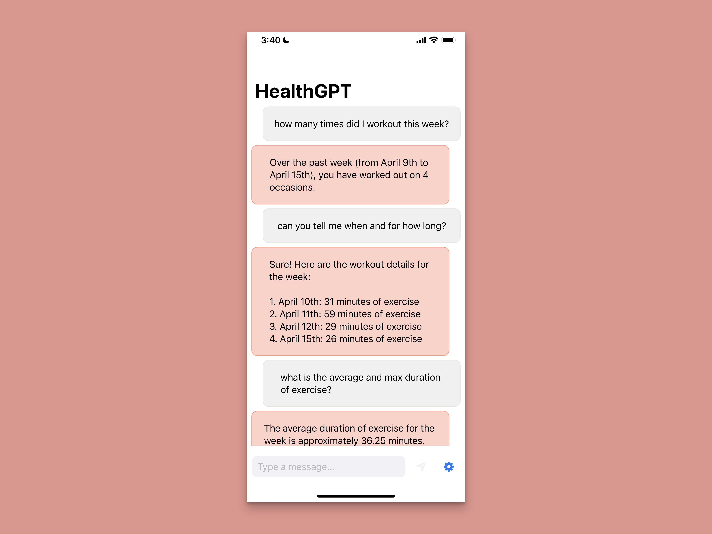

<!--

This source file is part of the Stanford HealthGPT project

SPDX-FileCopyrightText: 2023 Stanford University & Project Contributors
   
-->

# HealthGPT

HealthGPT is an experimental iOS app that allows users to interact with their health data stored in the Apple Health app using natural language.

Built on top of [CardinalKit](https://github.com/StanfordBDHG/CardinalKit) and the [CardinalKitTemplateApplication](https://github.com/StanfordBDHG/CardinalKitTemplateApplication/) and OpenAI.
HealthGPT offers an easy-to-extend solution for those looking to make large language model powered apps within the Apple Health ecosystem.

## Features

- Chat-style interface for user-friendly health data interaction
- Integration with the Apple Health app to ensure seamless first-party data usage
- Extensible architecture built on [CardinalKit](https://github.com/StanfordBDHG/CardinalKit) for easy customization
- GPT-3.5 + GPT-4 access through the [OpenAI](https://github.com/MacPaw/OpenAI) Swift module
- Out of the box support for querying sleep, step count, active energy, exercise minutes, heart rate, and body mass.

## Disclaimer

HealthGPT is provided for general informational purposes only and is not intended as a substitute for professional medical advice, diagnosis, or treatment. Large language models, such as those provided by OpenAI, are known to hallucinate and at times return false information. The use of HealthGPT is at your own risk. Always consult a qualified healthcare provider for personalized advice regarding your health and well-being. Aggregated HealthKit data for the past 14 days will be uploaded to OpenAI. Please refer to the [OpenAI privacy policy](https://openai.com/policies/privacy-policy) for more information.

## Set Up

1. Clone this repository.
2. Open `HealthGPT.xcodeproj` in Xcode. Wait for all dependencies to install and indexing to finish.
3. Replace the OpenAI API key placeholder in `Supporting Files/OpenAI-Info.plist` with your own from OpenAI's dashboard. You can also paste your key into the app during onboarding.
4. Run the app (on device or in the simulator) and play with HealthGPT on your own data 🚀

Note: if you're using the simulator, you will need to manually add data in the Health app. 
Otherwise, all of your results will read zero.

You can add queries for additional [HealthKit](https://developer.apple.com/documentation/healthkit) quantities and categories as follows:

1. Edit `HealthGPT/HealthGPT/HealthDataFetcher.swift` to create an appropriate query for your data type.
2. Update the prompt in `HealthGPT/HealthGPT/MessageInputView.swift` to pass the newly acquired data to the OpenAI API.

For any other quick changes (such as adding an onboarding flow), refer to the [CardinalKitTemplateApplication](https://github.com/StanfordBDHG/CardinalKitTemplateApplication/) repo.

## Contributing

Contributions to this project are welcome. Please make sure to read the [contribution guidelines](https://github.com/StanfordBDHG/.github/blob/main/CONTRIBUTING.md) and the [contributor covenant code of conduct](https://github.com/StanfordBDHG/.github/blob/main/CODE_OF_CONDUCT.md) first.

