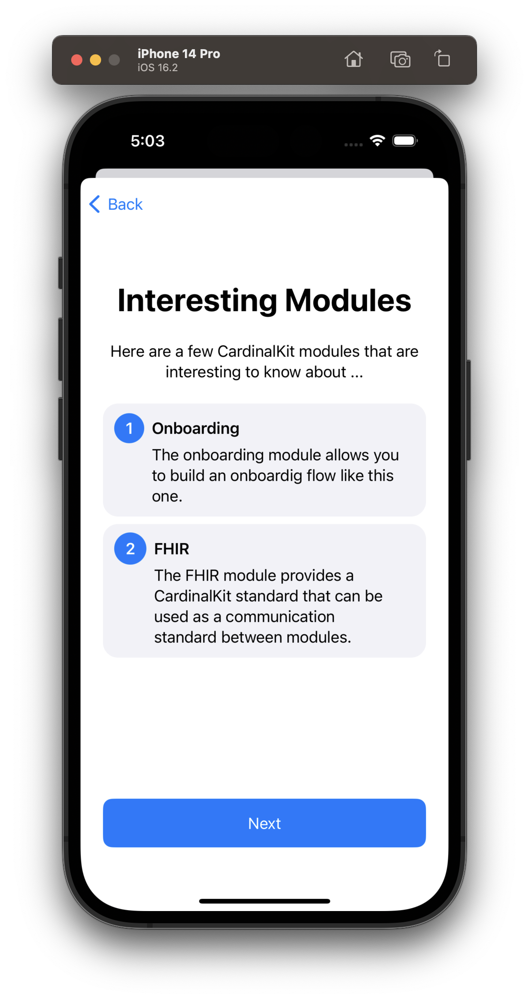
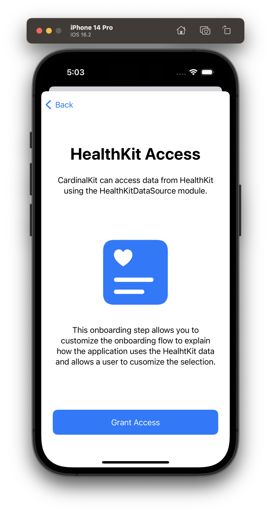
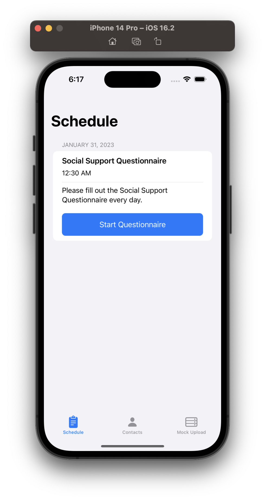
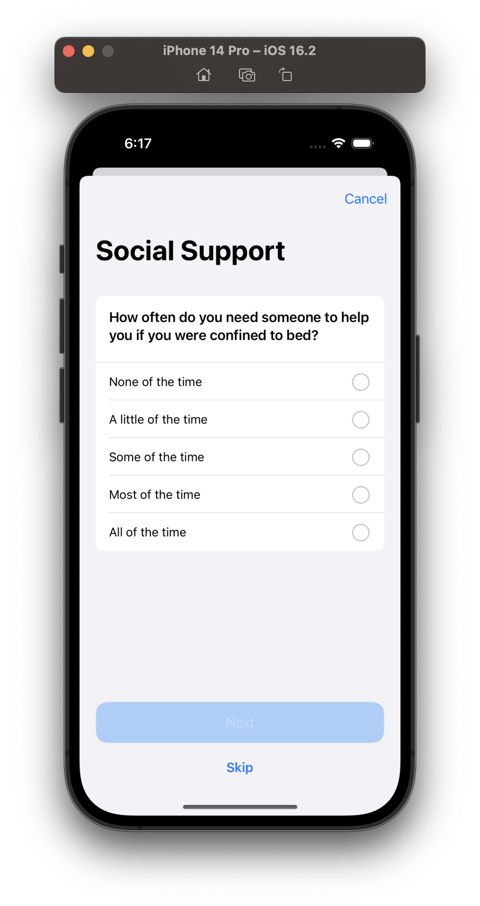
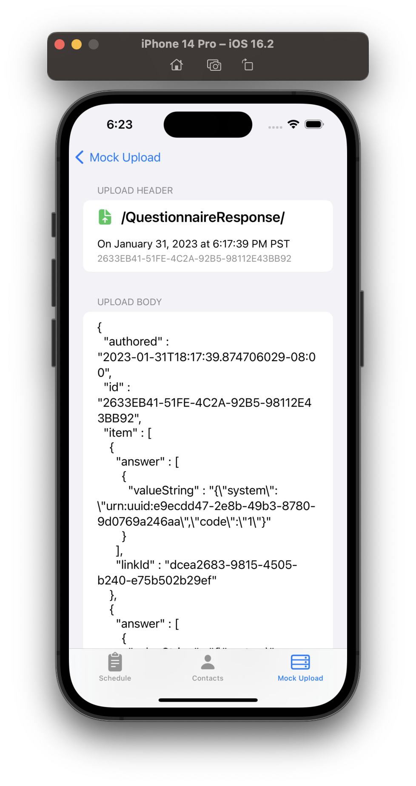

<!--

This source file is part of the Stanford CardinalKit Template Application project

SPDX-FileCopyrightText: 2023 Stanford University

SPDX-License-Identifier: MIT

-->

# CardinalKit Template Application

This repository contains the CardinalKit Template Application.
It demonstrates using the [CardinalKit](https://github.com/StanfordBDHG/CardinalKit) framework template and builds on top of the [StanfordBDHG Template Application](https://github.com/StanfordBDHG/TemplateApplication).

## Application Structure

The CardinalKit Template Application uses a modularized structure enabled by using the Swift Package Manager.

The application contains the following five modules that are separated into different Swift Package Manger Targets in the `TemplateApplicationModules` Swift Package.

The application uses the CardinalKit `FHIR` standard to provide a shared repository for data exchanged between different modules using the `FHIR` standard.
You can learn more about the CardinalKit standards-based software architecture in the [CardinalKit documentation](https://github.com/StanfordBDHG/CardinalKit).

### Template Onboarding Flow

The `TemplateOnboardingFlow` module contains the different steps displayed in the onboarding flow.
It uses the CardinalKit `Onboarding` module to display different onboarding-related views like the information about the application, a consent screen, and a screen to display a HealthKit consent view.

 
 
 
 

### Template Schedule

The `TemplateSchedule` module provides the functionality to schedule a recurring task and bind it to an action, e.g., displaying a questionnaire.
It uses the CardinalKit `Scheduler` and `Questionnaires` modules to schedule the tasks as defined in the `TemplateApplicationScheduler`.

 
 
 

### Template Contacts

The `TemplateContacts` module provides the functionality to display contact information in your application.
It uses the CardinalKit `Contacts` module to use the contact-related views provided by CardinalKit.

 

### Template Mock Data Storage Provider

The `TemplateMockDataStorageProvider` module allows a developer to get an overview of the synconization of data between the local `FHIR` model and a cloud storage provider.
It uses the CardinalKit `DataStorageProvider`s to get information that is stored in the `FHIR` standard in the CardinalKit Template Application.

 
 

## Continous Delivery Workflows

The CardinalKit Template application includes continuous integration (CI) and continuous delivery (CD) setup.
- Automatically build and test the application on every pull request before deploying it.
- An automated setup to deploy the application to TestFlight every time there is a new commit on the repository's main branch.
- Ensure a coherent code style by checking the conformance to the SwiftLint rules defined in `.swiftlint.yml` on every pull request and commit.
- Ensure conformance to the [REUSE Spacification]() to property license the application and all related code.

Please refer to the [StanfordBDHG Template Application](https://github.com/StanfordBDHG/TemplateApplication) and the [ContinousDelivery Example by Paul Schmiedmayer](https://github.com/PSchmiedmayer/ContinousDelivery) for more background about the CI and CD setup for the CardinalKit Template Application.

## Contributors & License

This project is based on [ContinousDelivery Example by Paul Schmiedmayer](https://github.com/PSchmiedmayer/ContinousDelivery), and the [StanfordBDHG Template Application](https://github.com/StanfordBDHG/TemplateApplication) provided using the MIT license.
You can find a list of contributors in the `CONTRIBUTORS.md` file.

The CardinalKit Template Application and the CardinalKit framework are licensed under the MIT license.
