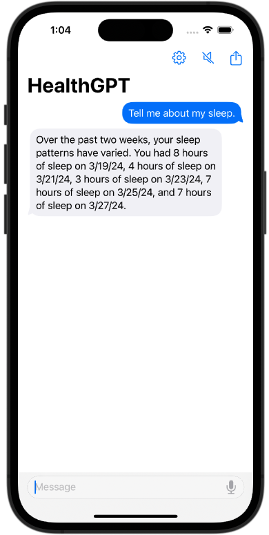
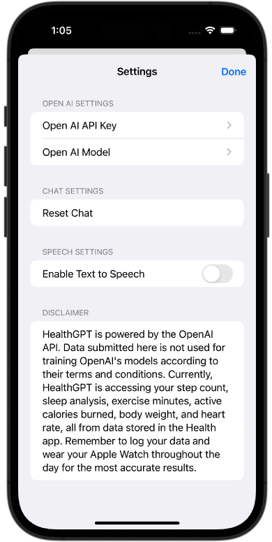
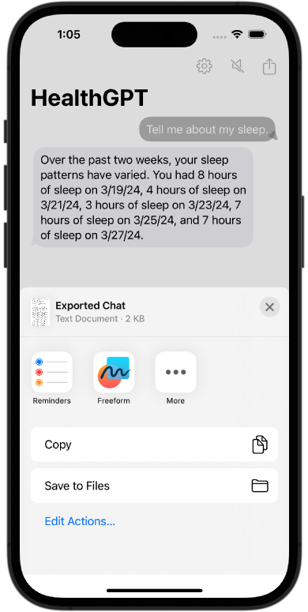

<!--

This source file is part of the Stanford HealthGPT project

SPDX-FileCopyrightText: 2023 Stanford University & Project Contributors (see CONTRIBUTORS.md)

SPDX-License-Identifier: MIT
   
-->

# HealthGPT

|<picture><source media="(prefers-color-scheme: dark)" srcset="Figures/Chat-dark.png"></picture>|<picture><source media="(prefers-color-scheme: dark)" srcset="Figures/Settings-dark.png"></picture>|<picture><source media="(prefers-color-scheme: dark)" srcset="Figures/Export-dark.png"></picture>|
|:--:|:--:|:--:|
|Example Conversation|Settings|Export Chat|

HealthGPT is an experimental iOS app based on [Stanford Spezi](https://github.com/StanfordSpezi/Spezi) that allows users to interact with their health data stored in the Apple Health app using natural language. The application offers an easy-to-extend solution for those looking to make large language model (LLM) powered apps within the Apple Health ecosystem.

HealthGPT is an open-source project of the [Stanford Biodesign Digital Health](https://bdh.stanford.edu/) team. The initial prototype based on [Spezi](https://github.com/StanfordSpezi/Spezi) and the [SpeziTemplateApplication](https://github.com/StanfordSpezi/SpeziTemplateApplication/) was built by [Varun Shenoy](https://varunshenoy.com).

> [!NOTE] 
> Do you want to try HealthGPT? You can download it to your iOS device using [TestFlight](https://testflight.apple.com/join/1wYMt3em)!

## Features

- Extensible architecture built on the [Stanford Spezi](https://github.com/StanfordSpezi/Spezi) open-source digital health development framework for easy customization.
- Chat-style interface for user-friendly health data interaction using the [SpeziChat](https://github.com/StanfordSpezi/SpeziChat) module with speech-to-text (recognition) as well as text-to-speech (synthesize) accessibility capabilities and chat export functionality.
- Integration with the Apple Health app via [SpeziHealthKit](https://github.com/StanfordSpezi/SpeziHealthKit).
- GPT-3.5 + GPT-4 queries through the [SpeziLLM](https://github.com/StanfordSpezi/SpeziLLM) module.
- Option for privacy preserving local execution of LLM queries using [SpeziLLMLocal](https://swiftpackageindex.com/stanfordspezi/spezillm/documentation/spezillmlocal) with [Llama3 8B](https://llama.meta.com/llama3/), including automated download and storage of model files during onboarding.
- Out of the box support for querying sleep, step count, active energy, exercise minutes, heart rate, and body mass.

## Disclaimer

HealthGPT is provided for general informational purposes only and is not intended as a substitute for professional medical advice, diagnosis, or treatment. Large language models, such as those provided by OpenAI, are known to hallucinate and at times return false information. The use of HealthGPT is at your own risk. Always consult a qualified healthcare provider for personalized advice regarding your health and well-being. Aggregated HealthKit data for the past 14 days will be uploaded to OpenAI. Please refer to the [OpenAI privacy policy](https://openai.com/policies/privacy-policy) for more information.

## Set Up

Building and running HealthGPT requires a Mac with [Xcode 15.2](https://developer.apple.com/xcode/) or newer installed.

1. Clone this repository to your local computer.
2. Open `HealthGPT.xcodeproj` in Xcode. Wait for all dependencies to install and indexing to finish.
3. Run the app (on an iOS device or in the iOS simulator) and play with HealthGPT on your own data 🚀

Note: If you are running HealthGPT using the simulator, you will need to manually add data in the Apple Health app. Otherwise, all of your results will read zero.

You can add queries for additional [HealthKit](https://developer.apple.com/documentation/healthkit) quantities and categories as follows:

1. Update the SpeziHealthKit configuration in [`HealthGPT/HealthGPT/AppDelegate.swift`](https://github.com/StanfordBDHG/HealthGPT/blob/main/HealthGPT/HealthGPTAppDelegate.swift) to include the additional data type(s). For more information about configuring SpeziHealthKit, please refer to the [official documentation](https://swiftpackageindex.com/StanfordSpezi/SpeziHealthKit/0.5.3/documentation/spezihealthkit).
2. Edit [`HealthGPT/HealthGPT/HealthDataFetcher.swift`](https://github.com/StanfordBDHG/HealthGPT/blob/main/HealthGPT/HealthGPT/HealthDataFetcher.swift) to create appropriate query for your data type(s).
3. Update the prompt in [`HealthGPT/HealthGPT/PromptGenerator.swift`](https://github.com/StanfordBDHG/HealthGPT/blob/main/HealthGPT/HealthGPT/PromptGenerator.swift) to pass the newly acquired data to the OpenAI API.

## Contributing

Contributions to this project are welcome. Please make sure to read the [contribution guidelines](https://github.com/StanfordBDHG/.github/blob/main/CONTRIBUTING.md) and the [contributor covenant code of conduct](https://github.com/StanfordBDHG/.github/blob/main/CODE_OF_CONDUCT.md) first.
You can find a list of contributors in the [`CONTRIBUTORS.md`](https://github.com/StanfordBDHG/HealthGPT/blob/main/CONTRIBUTORS.md) file.

## License

This project is licensed under the MIT License. See [Licenses](https://github.com/StanfordBDHG/HealthGPT/blob/main/LICENSES) for more information.

