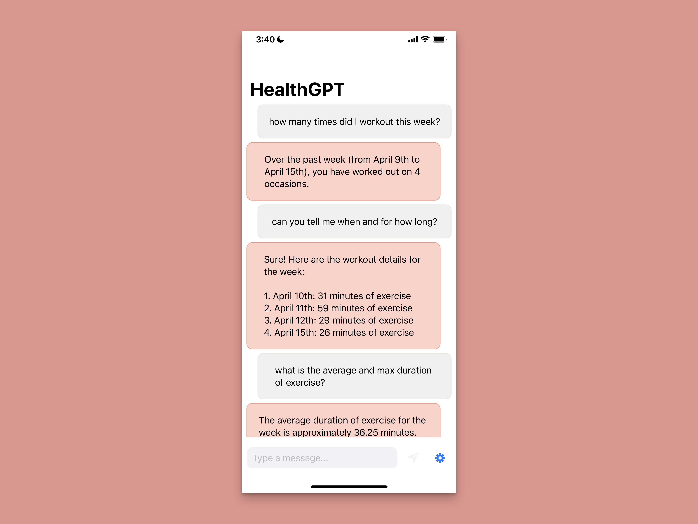

# HealthGPT

HealthGPT is an iOS app that allows users to interact with their health data stored in the Apple Health app using natural language.

Built on top of CardinalKit (via the [CardinalKitTemplateApplication](https://github.com/StanfordBDHG/CardinalKitTemplateApplication/)) and OpenAI, HealthGPT offers an easy-to-extend solution for those looking to make large language model powered apps within the Apple Health ecosystem.

## Features

- Chat-style interface for user-friendly health data interaction
- Integration with the Apple Health app to ensure seamless first-party data usage
- Extensible architecture built on [CardinalKit](https://github.com/StanfordBDHG/CardinalKit) for easy customization
- GPT-3.5 + GPT-4 access through the [OpenAI](https://github.com/MacPaw/OpenAI) Swift module
- Out of the box support for querying sleep, active energy, exercise minutes, and body mass.

## Set Up

1. Clone this repository.
2. Open `src/TemplateApplication.xcodeproj` in Xcode. Wait for all dependencies to install and indexing to finish.
3. Replace the OpenAI API key in `MessageInputView.swift` with your own from OpenAI's dashboard.
4. Run the app (on device or in the simulator) and play with HealthGPT on your own data 🚀

Note: if you're using the simulator, you will need to manually add data in the Health app. Otherwise, all of your results will read zero.

You can add queries for additional [HealthKit](https://developer.apple.com/documentation/healthkit) quantities and categories as follows:

1. Edit `src/TemplateApplication/HealthDataFetcher.swift` to create an appropriate query for your data type.
2. Update the prompt in `src/TemplateApplication/MessageInputView.swift` to pass the newly acquired data to the OpenAI API.

For any other quick changes (such as adding an onboarding flow), refer to the [CardinalKitTemplateApplication](https://github.com/StanfordBDHG/CardinalKitTemplateApplication/) repo.

## TODOs

- [ ] stream GPT responses to the client in order to hide latency (currently broken in the SPM module: https://github.com/MacPaw/OpenAI/issues/14)
- [ ] store the API key in a config/plist file (or generally in a more secure way)
- [ ] enable users to disconnect health data streams at will
- [ ] provide support for more HealthKit types
- [ ] chain LLM queries to first identify which data to pull from HealthKit and then construct a prompt
- [ ] access data from the current day

_Feel free to create a PR with any code that you might find helpful!_
